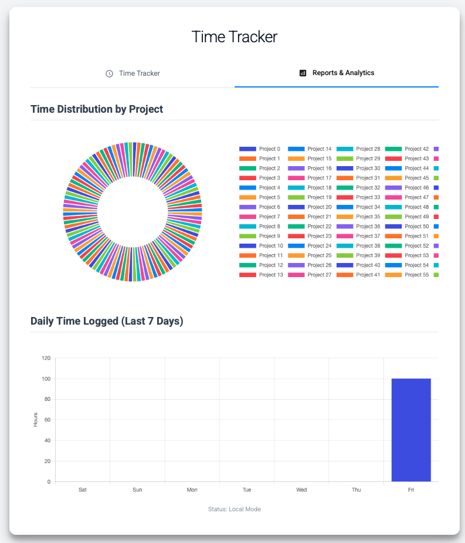

# TimeTrackly

> **Your Time, Your Data.** A simple, private, and offline-first time tracker.

TimeTrackly is a modern time tracker built on a single principle: **your data belongs to you.** It runs entirely on your local machine, has zero external dependencies, and never sends your information anywhere. It's designed for developers, freelancers, and anyone who wants a reliable, private tool to track their work without compromise.

_Clean, Material Design-inspired interface with collapsible sections_

## 1. Features at a Glance

- **Hierarchical Tracking:** Organize your work effortlessly by grouping tasks under collapsible project headers.
- **Never Lose Your Work:** With automatic session persistence, your active timers are safe even if you close your browser or restart your computer.
- **100% Private & Offline:** All data is stored locally in human-readable JSON files. No clouds, no sign-ups, no data collection.
- **Essential Controls:** Everything you need: Start, Pause, Resume, Stop (Save), and Delete (Discard) active tasks.
- **Notes & Comments:** Add context to your work. Notes are auto-saved and included in your data exports.
- **Clean, Focused UI:** Collapsible sections for starting timers, viewing active work, and exporting data keep your workspace tidy.
- **Instant Insights:** A dedicated Reports tab provides real-time visualizations, including Project Time Distribution and Daily Time Logged charts.
- **Smart Input:** Autocomplete suggestions are populated from your recent entries and a simple, user-editable `mtt-suggestions.json` file.
- **Rock-Solid Data Integrity:** Prevents concurrent tracking of the same task and uses atomic file writes to protect your data.
- **Built-in Health Check:** A simple endpoint to verify that the server is running and your data files are healthy.

### Active Timer Management

- Track multiple tasks simultaneously with real-time duration display
- Start, Pause, Resume, Stop (Save), and Delete (Discard) controls for each timer
- Add notes to tasks that auto-save and export with your data

### Reports & Analytics

_Visualize your time distribution across projects and daily activity_

## 2. How to Use the Application

Once the server is running, the workflow is simple and intuitive.

### 2.1. Core Workflow

- **Enter a Task:** In the input field, type the task you want to track using the `Project / Task` format.
- **Start the Timer:** Click the **Start** button to see a new timer appear under the appropriate project.
- **Track Multiple Tasks:** Run as many timers as you need concurrently. TimeTrackly will group them by project.
- **Stop and Save:** When a task is complete, click **Stop**. The timer is removed from the active list and its data is permanently saved to `mtt-data.json`.

### 2.2. Managing Active Timers

- **Pause/Resume:** Click **Pause** to take a break. The timer's border will turn orange. Click **Resume** to pick up where you left off.
- **Delete (Discard):** Started a timer by mistake? Click **Delete** to remove it without saving any data.
- **Collapse Projects:** Keep your view tidy by clicking any project header to collapse or expand its task list.

### 2.3. Reports and Data

- **View Reports:** Click the **Reports & Analytics** tab to see charts of your historical data.
- **Export Data:** On the "Time Tracker" tab, click the **Export All Data (CSV)** button to download a complete record of all completed tasks.

### 2.4. Error Handling & Validation

_Clear error messages guide you when input is invalid_

## 3. Stack & Deployment

The application runs locally using a simple Node.js server with zero external dependencies.

| Component         | Technology                                                                 | Role                                                                             |
| :---------------- | :------------------------------------------------------------------------- | :------------------------------------------------------------------------------- |
| **Client**        | HTML5, ES6 Modules, Vanilla JavaScript, Tailwind CSS (CDN), Chart.js (CDN) | Modular UI with 7 ES6 modules for separation of concerns                         |
| **Backend**       | Node.js (with built-in `http`, `fs.promises`, and `path` modules)          | Local web server with atomic file I/O and health monitoring                      |
| **Data Storage**  | `mtt-data.json` & `mtt-active-state.json`                                  | JSON-based persistence for **historical** and **in-progress** data, respectively |
| **Configuration** | `mtt-suggestions.json`                                                     | A user-editable JSON file for populating input suggestions                       |
| **Deployment**    | Local Machine Execution                                                    | Run via `npm start` or `npm run dev`                                             |

## 4. Getting Started

- **Clone the Repository:**
  - `git clone https://github.com/kanad13/time-tracker.git`
  - `cd time-tracker`
- **Setup & Run:** Follow the simple instructions in the `setup.md` file to get the application running on your machine in under a minute.

## 5. Detailed Guidance

- For a deep dive into the architecture and design rationale, please refer to the comprehensive `architecture.md`.
